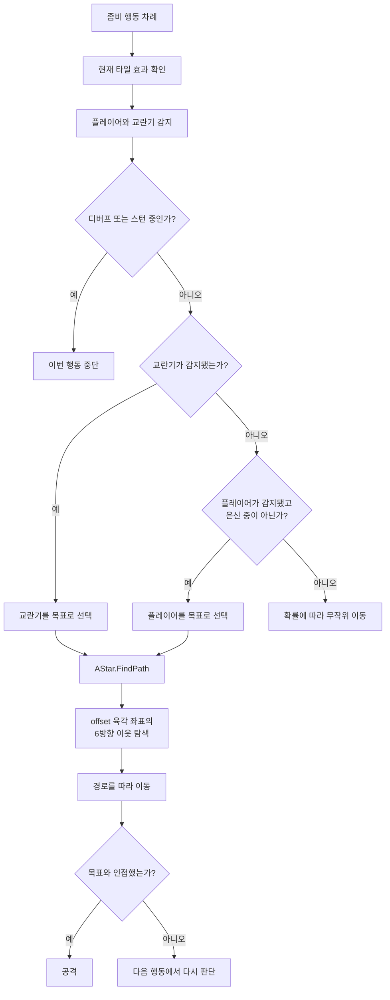
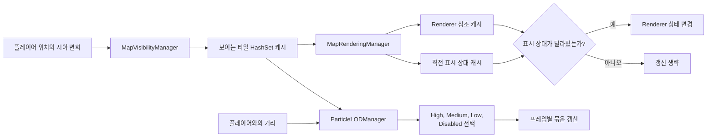

# DEAD.NET

제한된 시간 안에 육각 타일 맵을 탐색하고 자원을 모은 뒤 생존하는 PC 전략 게임입니다.

[플레이 영상](https://www.youtube.com/watch?v=fxQpeaKqd0A)

## 프로젝트 정보

| 항목 | 내용 |
| --- | --- |
| 개발 기간 | 2023.03.17 - 2024.05.05, 후속 최적화 2025.07 - 2025.09 |
| 팀 구성 | 8명, 기획 2명, 개발 2명, 아트 3명, 사운드 1명 |
| 개인 담당 | 좀비 AI, 육각 타일 이동, 드론, 맵과 엔티티 관리, 후속 성능 개선 |
| 개발 환경 | Unity 2021.3.15f1, C# |
| 결과 | 챕터 1 완성, 2024 인디크래프트 챌린저 부문 TOP 20 |

## 실제 플레이 화면

| 좀비 무리와 조우 | 육각 타일 맵과 시야 범위 |
|---|---|
|  |  |

화면 전환과 자원 수집, 좀비 조우 과정은 [플레이 영상](https://www.youtube.com/watch?v=fxQpeaKqd0A)에서 이어서 볼 수 있습니다.

## 어떤 문제를 풀었나

좀비 수가 늘고 맵이 확장되는 게임이라 두 가지가 함께 해결되어야 했습니다.

1. 좀비가 플레이어만 따라가면 교란기와 지형 효과를 무시했습니다.
2. 좀비 수가 많아지고 맵이 커질수록 렌더링과 상태 갱신 대상이 함께 늘어 플레이가 10.7fps까지 떨어졌습니다.

목표 선택과 경로 탐색을 먼저 분리했습니다. 이후 좀비 수와 맵 크기를 늘려 프레임 저하를 재현하고, Profiler로 실제 병목을 찾아 갱신 범위를 줄였습니다.

## 개인 기여

| 영역 | 구현 내용 |
| --- | --- |
| 좀비 AI | 교란기, 플레이어, 무작위 이동의 목표 우선순위와 상황별 행동 규칙 구현 |
| 길찾기 | offset 좌표의 육각 타일 6방향 이웃과 우선순위 큐를 사용한 A* 경로 탐색 |
| 상태 변화 | 감지 거리, 지형 효과, 스턴과 주변 개체 합류를 다음 판단 조건에 반영 |
| 드론 | 탐색과 교란 역할별 배치, 상태와 효과 처리 |
| 성능 | 시야 밖 Renderer 제한, 이전 표시 상태 캐시, 거리와 시야 기반 Particle LOD |

## 핵심 구현 1. 목표 선택과 경로 계산을 분리

### 문제

모든 좀비가 플레이어만 추적하면 교란기가 게임 규칙으로 작동하지 않았습니다. 반대로 가장 가까운 목표만 고르면 스턴이나 지형 효과처럼 전투 중 바뀌는 상태를 다음 행동에 반영하기 어려웠습니다.

### 선택 이유

무엇을 쫓을지와 어떻게 갈지를 한 알고리즘에 섞지 않았습니다. 목표는 교란기, 플레이어, 무작위 이동 순의 규칙으로 결정하고, 선택된 목표까지의 이동은 육각 타일 A*가 담당하게 했습니다. 이 구조라면 기획자가 목표 우선순위를 바꿔도 길찾기를 다시 작성할 필요가 없습니다.

### 구현

- `Coords`의 X, Y offset 좌표에서 홀짝 열을 구분해 6방향 이웃 계산
- custom priority queue와 노드 캐시를 사용하는 A* 구현
- 현재 A* 휴리스틱은 X, Y 차이의 합을 사용하는 Manhattan 방식
- 감지 거리와 타일 상태가 달라지면 목표와 경로를 다시 평가
- 스턴 중에는 이동을 중단하고 해제 뒤 현재 환경에서 다시 판단
- 주변 좀비가 전투에 합류할 때 동일한 목표 선택 규칙 적용

### 결과와 한계

교란기와 플레이어가 함께 있을 때도 규칙에 따라 목표를 바꾸고 육각 타일을 따라 이동하게 만들었습니다. 당시에는 경로 탐색 시간의 p95나 개체 수별 처리량을 별도로 보존하지 못해 성능 수치로 주장하지 않습니다. 또한 현재 휴리스틱은 육각 좌표 전용 거리식이 아니므로 최단 경로의 최적성을 별도로 검증한 구현은 아닙니다.

## 핵심 구현 2. 좀비 수와 맵 크기 확장으로 발생한 병목을 줄여 10.7fps를 목표 60fps로 회복

### 문제 발견

좀비 수를 늘리거나 맵을 확장하면 프레임이 떨어졌습니다. 처음에는 좀비 행동과 A* 연산을 의심했지만, Unity Profiler로 메인 스레드와 렌더링 작업을 나눠 확인하자 다른 병목이 더 컸습니다. 맵이 넓어질수록 시야 밖 타일과 오브젝트가 늘었고, 좀비가 많아질수록 Renderer와 상태 갱신 대상도 함께 늘었습니다. Unity의 정적 Occlusion Culling만으로는 런타임에 생성되는 모든 오브젝트를 대상으로 삼기 어려웠습니다.

### 해결

- 플레이어 시야 범위 밖의 Renderer를 비활성화
- Renderer 참조와 직전 표시 상태를 캐시해 상태가 달라진 대상만 갱신
- Renderer가 있는 대상은 GameObject 전체 대신 Renderer의 `enabled`만 변경
- 파티클은 시야 포함 여부와 거리에 따라 High, Medium, Low, Disabled 단계로 조절
- 타일과 파티클 초기화 작업을 여러 프레임에 나눠 한 프레임에 부하가 몰리지 않게 처리

### 검증 결과

같은 장비에서 좀비 수와 맵 크기를 동일하게 유지한 채 개선 전후를 Unity Profiler로 측정해 10.7fps에서 목표 60fps까지 회복했습니다. FPS 기준 약 5.6배입니다. 측정 로그의 장기 보관과 프레임 시간 분포 비교는 하지 못했으므로, 이 수치는 당시 동일 환경에서 확인한 전후 결과로 한정합니다.

## 실행 방법

1. Unity Hub에서 Unity 2021.3.15f1로 프로젝트를 엽니다.
2. Package Manager가 의존성을 복원할 때까지 기다립니다.
3. 게임 시작 장면에서 Play를 실행합니다.

저장소에는 별도의 오픈소스 라이선스가 명시되어 있지 않습니다. 코드와 게임 리소스를 재사용하려면 원 프로젝트 팀의 허가가 필요합니다.
