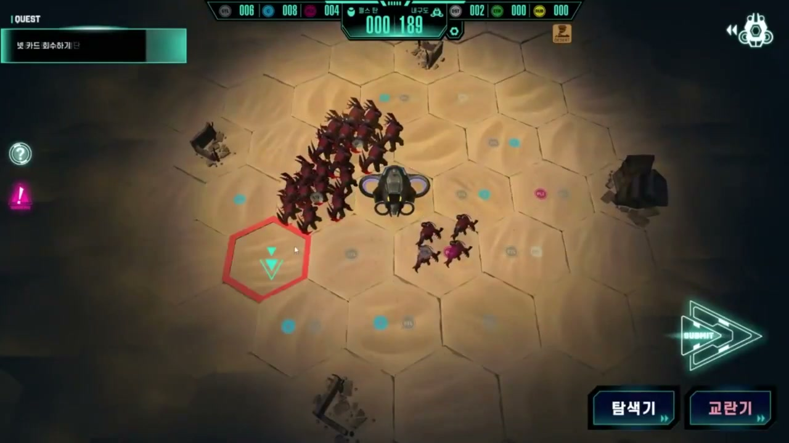
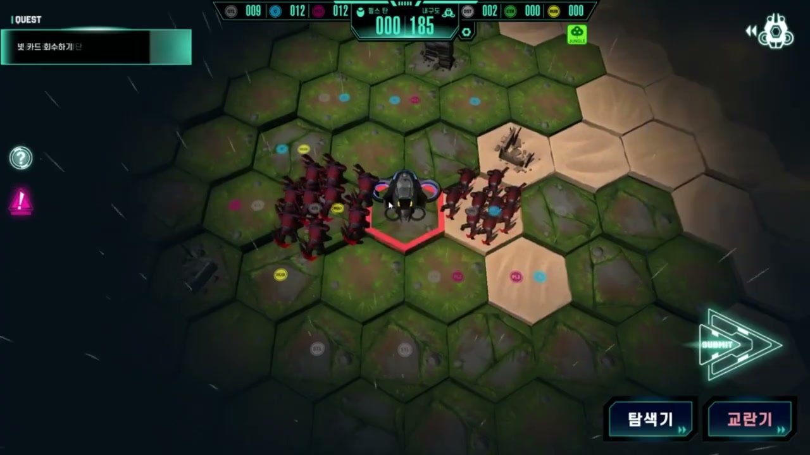
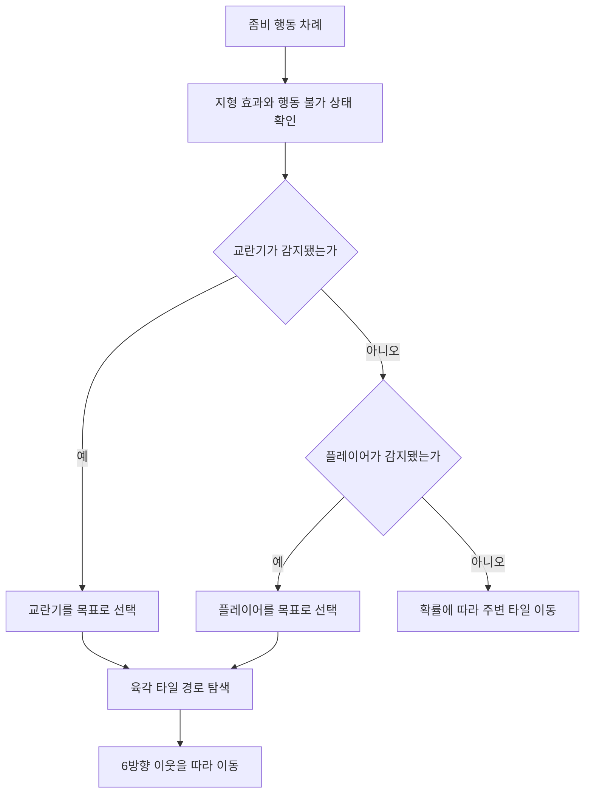
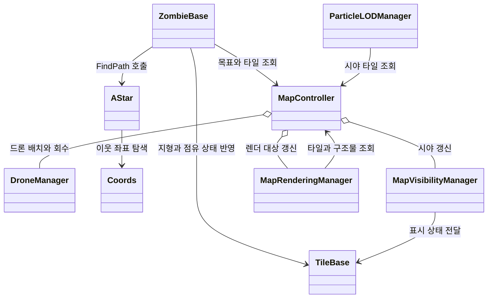
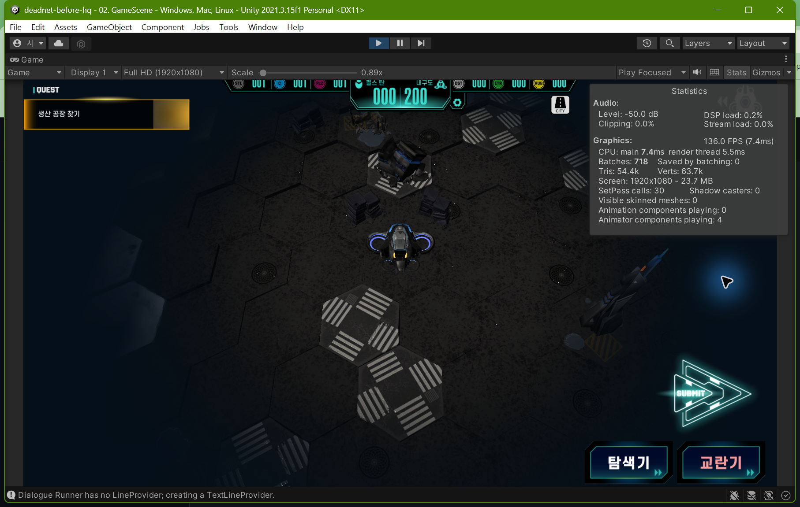
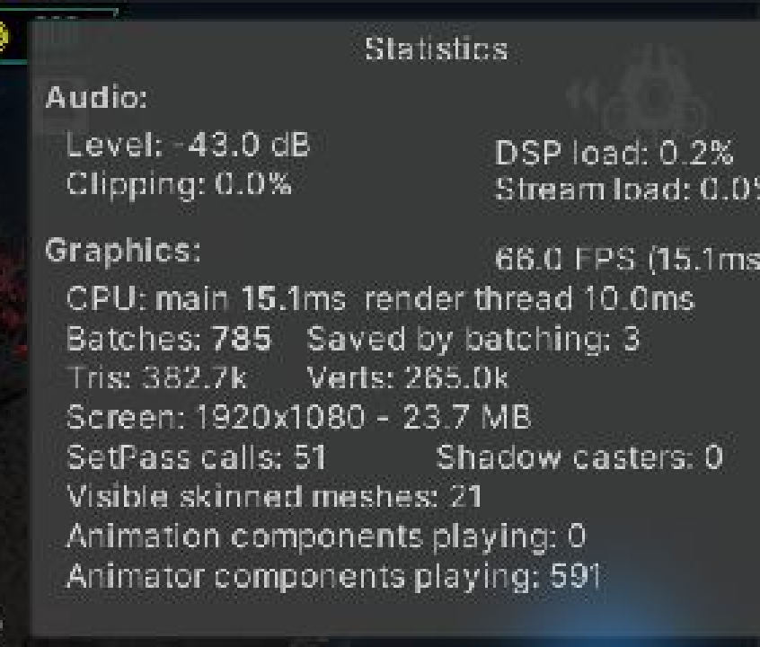
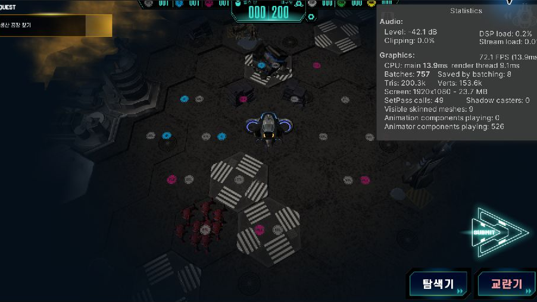
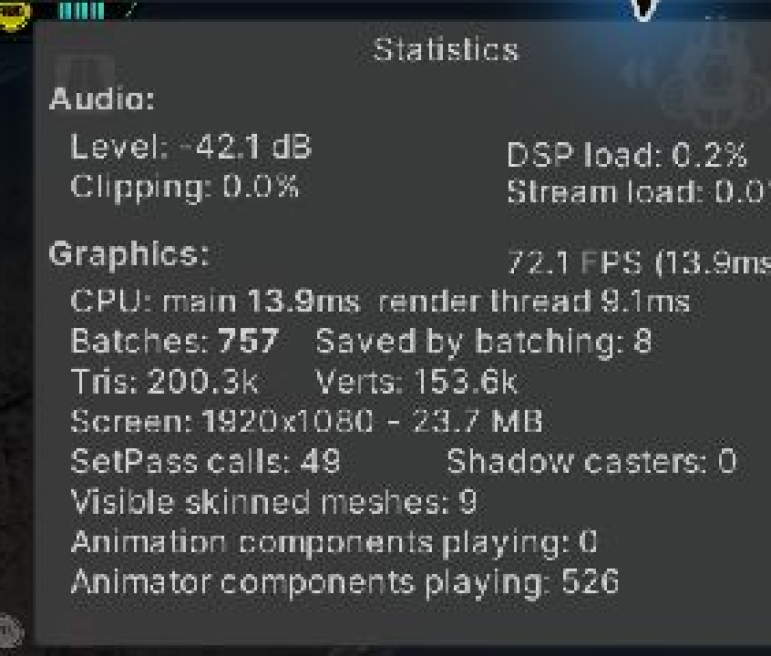

# DEAD.NET

제한된 시간 안에 육각 타일 맵을 탐색하고 자원을 모으며 좀비 무리에서 살아남는 PC 전략 게임입니다.

[플레이 영상](https://www.youtube.com/watch?v=fxQpeaKqd0A)

## 시작한 이유

Unity에서 캐릭터 한 명을 움직이는 데서 나아가, 여러 유닛이 같은 육각 타일 규칙을 공유하는 전략 게임을 팀으로 완성해 보고 싶었습니다.

제한된 시야 안에서 탐색기와 교란기를 배치하고, 좀비의 목표를 바꾸며 탈출 경로를 만드는 플레이를 중심에 두었습니다. 이 과정에서 좀비 판단, 타일 경로 탐색과 다수 오브젝트의 렌더링을 함께 다뤘습니다.

## 프로젝트 개요

| 항목 | 내용 |
| --- | --- |
| 개발 기간 | 2023.03.17 - 2024.05.05, 후속 최적화 2025.07 - 2025.09 |
| 팀 구성 | 8명, 기획 2명, 개발 2명, 아트 3명, 사운드 1명 |
| 개발 환경 | Unity 2021.3.15f1, C# |
| 팀 결과 | 챕터 1 완성, 2024 인디크래프트 챌린저 부문 TOP 20 |
| 개인 담당 | 좀비 AI, 육각 타일 이동, 드론, 맵과 엔티티 관리, 후속 성능 개선 |

| 좀비 무리와 조우 | 육각 타일 맵과 시야 범위 |
| --- | --- |
|  |  |

화면 전환과 자원 수집, 좀비 조우 과정은 플레이 영상에서 이어서 볼 수 있습니다.

## 프로젝트에서 마주한 문제

좀비는 플레이어만 따라가서는 안 됐습니다. 교란기가 가까이 있으면 목표를 바꾸고, 스턴이나 지형 효과가 남아 있으면 이번 행동을 멈춰야 했습니다. 아무 목표도 감지하지 못한 경우에는 확률에 따라 주변 타일을 움직입니다.

맵과 좀비 수가 늘자 다른 병목도 나타났습니다. 시야 밖 타일과 오브젝트도 표시 상태를 계속 갱신했고, 같은 상태를 반복해서 바꿨습니다. 이후 시야 판정, 렌더 상태 cache, Particle LOD의 책임을 나눴습니다.

## 개인 기여

| 영역 | 구현 내용 |
| --- | --- |
| 좀비 행동 | 교란기, 플레이어, 무작위 이동 순으로 목표를 고르는 규칙과 스턴, 지형 효과 처리 |
| 육각 타일 이동 | 홀수 열과 짝수 열을 구분한 6방향 이웃 계산과 경로 탐색 |
| 드론 | 탐색기와 교란기의 배치, 이동, 회수와 목표 감지 연결 |
| 렌더링 | 시야 타일, Renderer 참조, 직전 표시 상태를 캐시하고 바뀐 대상만 갱신 |
| 파티클 | 시야 포함 여부와 플레이어 거리에 따른 Particle LOD |

후속 작업에서 AStar node cache, 맵 가시성 cache, Particle LOD, 좀비와 타일 갱신 분리를 구현했습니다.

## 문제 해결 과정

### 좀비 판단과 육각 타일 이동

`ZombieBase.ActionDecision`은 행동을 고르는 순서를 코드로 고정합니다. 디버프와 스턴을 먼저 확인하고, 감지 범위 안에 교란기가 있으면 교란기를 향합니다. 그다음 플레이어를 확인하며, 둘 다 없을 때만 무작위 이동을 시도합니다.

`Coords`는 열의 홀짝을 기준으로 여섯 이웃을 계산합니다. `AStar.FindPath`는 custom heap, 방문 집합, node cache와 Manhattan 형태의 휴리스틱을 사용합니다.

`MapController`가 manager를 묶고, `ZombieBase`는 목표 조회와 이동 결과 반영에만 이 경계를 사용합니다. 경로 탐색은 `AStar`와 `Coords`, tile 상태는 `TileBase`가 맡습니다.

#### 육각 타일 이동 문제

Drone과 Zombie는 육각 타일에서 다음 이동 후보를 골라야 했습니다. 경로 탐색은 이동 가능한 타일만 통과해야 하고, 여섯 이웃의 열거 방식도 좌표 체계와 맞아야 했습니다.

#### 육각 타일 탐색

`AStar.FindPath`는 available tile 집합을 만들고 `Coords` 이웃을 방문 집합과 함께 탐색합니다. custom heap과 node cache를 사용해 반복 탐색에서 같은 좌표 객체를 다시 만들지 않도록 했습니다.

#### MapPathfindingManager 분리

현재 구현은 이 hex grid search 경로를 사용합니다. 이후 `MapPathfindingManager`가 선택한 타일을 `AStar.FindPath`에 전달해 Player 이동 경로를 저장하도록 책임을 분리했습니다.

### 시야 밖 렌더링 비용 줄이기

#### 시야 밖 렌더링 문제

시야 밖 타일과 오브젝트도 계속 그려졌고, 표시 상태가 바뀌지 않아도 갱신이 반복됐습니다.

#### visibility와 rendering 분리

`MapVisibilityManager`는 시야 타일을 계산하고, `MapRenderingManager`는 타일과 구조물의 Renderer 상태를 갱신합니다.

#### renderer cache와 Particle LOD 선택

Renderer 참조와 직전 표시 상태를 cache해 달라진 대상만 처리했습니다. 이후 Particle LOD가 시야와 플레이어 거리를 기준으로 파티클을 나눠 갱신하도록 분리했습니다.

#### 같은 지도 화면에서 다시 측정

Unity 2021.3.15f1 Editor에서 플레이어와 카메라를 같은 위치에 두고 Game View Statistics를 확인했습니다.

| 항목 | 최적화 전 | 최적화 후 | 변화 |
| --- | ---: | ---: | ---: |
| FPS | 66.0 | 72.1 | +6.1 |
| CPU main | 15.1ms | 13.9ms | -1.2ms |
| Triangles | 382.7k | 200.3k | -182.4k |
| Visible skinned meshes | 21 | 9 | -12 |
| Animator components playing | 591 | 526 | -65 |

렌더링 대상과 애니메이션 갱신 대상을 줄인 뒤 triangle, visible skinned mesh와 animator component 수가 함께 감소했고 CPU main과 FPS도 같은 방향으로 변했습니다.

##### 최적화 전 전체 화면

##### 최적화 전 Statistics 확대

##### 최적화 후 전체 화면

##### 최적화 후 Statistics 확대

## 실행 방법

1. Unity Hub에서 Unity 2021.3.15f1로 프로젝트를 엽니다.
2. Package Manager가 의존성을 복원할 때까지 기다립니다.
3. 게임 시작 장면에서 Play를 실행합니다.

## 남은 과제

- 좀비의 목표 우선순위와 감지 범위를 data로 분리
- 육각 타일 경로와 시야 변경을 검사하는 PlayMode test 추가
- 대규모 좀비 전투에서 Particle LOD와 갱신 주기 세분화
