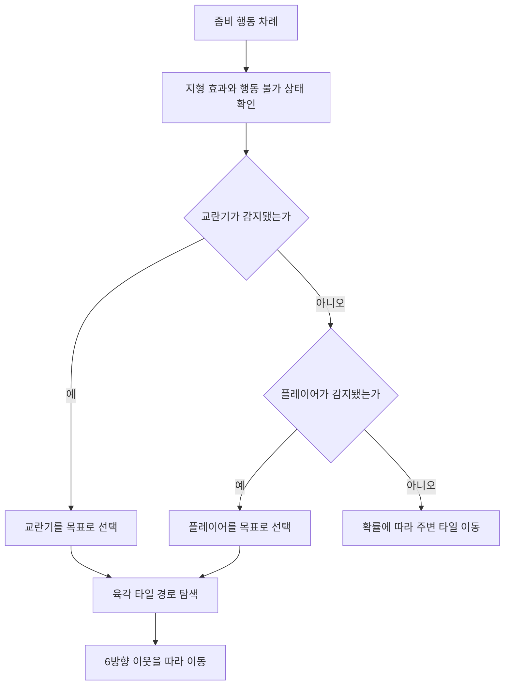
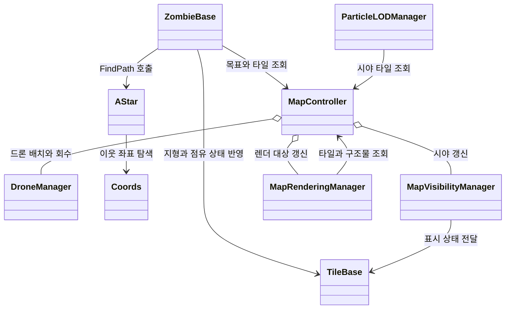

# DEAD.NET

제한된 시간 안에 육각 타일 맵을 탐색하고 자원을 모으며 좀비 무리에서 살아남는 PC 전략 게임입니다.

[플레이 영상](https://www.youtube.com/watch?v=fxQpeaKqd0A)

## 프로젝트 개요

| 항목 | 내용 |
| --- | --- |
| 개발 기간 | 2023.03.17 - 2024.05.05, 후속 최적화 2025.07 - 2025.09 |
| 팀 구성 | 8명, 기획 2명, 개발 2명, 아트 3명, 사운드 1명 |
| 개발 환경 | Unity 2021.3.15f1, C# |
| 팀 결과 | 챕터 1 완성, 2024 인디크래프트 챌린저 부문 TOP 20 |
| 개인 담당 | 좀비 AI, 육각 타일 이동, 드론, 맵과 엔티티 관리, 후속 성능 개선 |

| 좀비 무리와 조우 | 육각 타일 맵과 시야 범위 |
| --- | --- |
|  |  |

화면 전환과 자원 수집, 좀비 조우 과정은 플레이 영상에서 이어서 볼 수 있습니다.

## 해결한 문제

좀비는 플레이어만 따라가서는 안 됐습니다. 교란기가 가까이 있으면 목표를 바꾸고, 스턴이나 지형 효과가 남아 있으면 이번 행동을 멈춰야 했습니다. 아무 목표도 감지하지 못한 경우에는 확률에 따라 주변 타일을 움직입니다.

맵과 좀비 수가 늘자 다른 병목도 나타났습니다. 플레이 영역 밖의 타일과 오브젝트까지 계속 그렸고, 같은 표시 상태를 반복해서 갱신했습니다. Unity Profiler로 확인한 뒤 시야와 거리를 기준으로 실제 갱신 대상을 줄였습니다.

## 개인 기여

| 영역 | 구현 내용 |
| --- | --- |
| 좀비 행동 | 교란기, 플레이어, 무작위 이동 순으로 목표를 고르는 규칙과 스턴, 지형 효과 처리 |
| 육각 타일 이동 | 홀수 열과 짝수 열을 구분한 6방향 이웃 계산과 경로 탐색 |
| 드론 | 탐색기와 교란기의 배치, 이동, 회수와 목표 감지 연결 |
| 렌더링 | 시야 타일, Renderer 참조, 직전 표시 상태를 캐시하고 바뀐 대상만 갱신 |
| 파티클 | 시야 포함 여부와 플레이어 거리에 따른 Particle LOD |

후속 최적화 이력에는 AStar node cache, 맵 가시성 cache, Particle LOD, 좀비와 타일 갱신 분리 작업이 남아 있습니다. 팀 전체 구현이나 인디크래프트 결과는 개인 성과로 표시하지 않습니다.

## 좀비 판단과 육각 타일 이동

`ZombieBase.ActionDecision`은 행동을 고르는 순서를 코드로 고정합니다. 디버프와 스턴을 먼저 확인하고, 감지 범위 안에 교란기가 있으면 교란기를 향합니다. 그다음 플레이어를 확인하며, 둘 다 없을 때만 무작위 이동을 시도합니다.

`Coords`는 열의 홀짝을 기준으로 여섯 이웃을 계산합니다. `AStar.FindPath`는 custom heap, 방문 집합, node cache와 Manhattan 형태의 휴리스틱을 사용합니다.

`MapController`가 manager를 묶고, `ZombieBase`는 목표 조회와 이동 결과 반영에만 이 경계를 사용합니다. 경로 탐색은 `AStar`와 `Coords`, tile 상태는 `TileBase`가 맡습니다. source는 `Assets/02. Scripts/Map`과 `Assets/Hexamap`에서 확인할 수 있습니다.

현재 구현은 계산한 `gScore`와 `fScore`를 heap이 비교하는 `Node` 우선순위 값에 연결하지 않습니다. 휴리스틱도 육각 좌표 전용 거리식이 아닙니다. 따라서 저장소에서는 최단 경로의 최적성을 검증했다고 주장하지 않습니다.

## 시야 밖 렌더링 비용 줄이기

`MapVisibilityManager`는 플레이어 시야 타일을 `HashSet`에 보관합니다. `MapRenderingManager`는 타일과 구조물 목록, Renderer 참조, 직전 표시 상태를 캐시하고 상태가 달라진 대상만 갱신합니다.

위 관계도에서 visibility와 rendering은 같은 타일을 다루지만 책임이 다릅니다. visibility는 `TileBase.UpdateVisibilityFromController`로 game state를 전달하고, rendering은 `MapController`에서 표시 대상을 읽어 Renderer 변경을 분산합니다. `ParticleLODManager`는 시야와 거리를 별도로 조회합니다.

표시 여부를 바꿀 때는 가능한 경우 GameObject 전체를 켜고 끄지 않고 Renderer의 `enabled`를 변경합니다. 타일 visibility 갱신은 한 번에 몰리지 않도록 묶어서 나누며, Particle LOD도 같은 시야 흐름 뒤에서 갱신합니다.

같은 장비와 같은 편집 조건에서 개선 전 10.7fps였던 장면이 목표 60fps에 도달했습니다. 원본 profiler log와 반복 측정 분포는 보존하지 못했으므로 당시 확인한 전후 결과로만 한정합니다.

## 검증 범위와 한계

- 육각 타일 경로 탐색의 최단 경로 최적성은 검증하지 않았습니다.
- 10.7fps와 60fps는 같은 환경의 전후 관측값이며 장기 frame time 자료가 남아 있지 않습니다.
- 이 포트폴리오 branch에는 별도의 자동화 테스트 명령이 없습니다. 구현 근거는 소스와 Git history로 확인했습니다.
- 프로젝트 저장소는 Unity 2021.3.15f1을 기준으로 합니다.

## 실행 방법

1. Unity Hub에서 Unity 2021.3.15f1로 프로젝트를 엽니다.
2. Package Manager가 의존성을 복원할 때까지 기다립니다.
3. 게임 시작 장면에서 Play를 실행합니다.

## 재사용 범위

저장소에는 별도의 오픈소스 라이선스가 명시되어 있지 않습니다. 코드와 게임 리소스를 재사용하려면 원 프로젝트 팀의 허가가 필요합니다.
